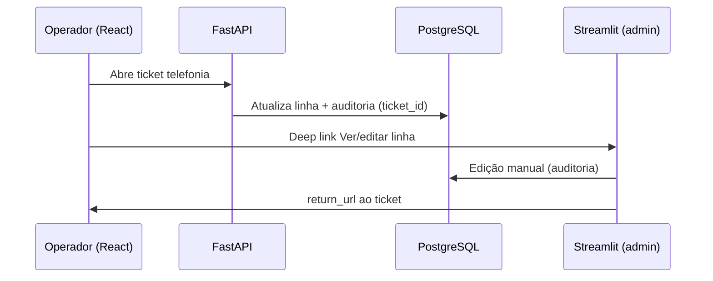

# Case study — Chamados TI + Telefonia integrada

> Projeto pessoal / portfólio · dados fictícios · maio/2026

---

## Problema

Em operações de campo com centenas de linhas móveis, o ciclo **chamado → alteração de linha → auditoria** costuma ficar fragmentado: planilhas, sistemas distintos e histórico difícil de rastrear. O operador perde tempo alternando ferramentas; o gestor não consegue responder “quem alterou esta linha e por qual ticket?”.

## Solução

Monorepo com **dois frontends complementares** sobre **um PostgreSQL**:

1. **Sistema de Chamados TI (React + FastAPI)** — produto principal: tickets, fluxos de telefonia, dashboard.  
2. **Gerenciamento de Telefones (Streamlit)** — painel admin: grid denso, histórico bruto, configuração.  
3. **Integração** — API `/api/telefones`, SSO entre apps, deep links com `ticket_id` e `return_url`, auditoria unificada.

## Arquitetura (decisões)

| Decisão | Motivo |
|---------|--------|
| PostgreSQL único | Uma fonte de verdade para linhas, tickets e auditoria |
| Chamados como app principal | Operador não depende do Streamlit no dia a dia |
| Streamlit admin-only (C3) | Papel claro: complemento técnico, não segundo produto |
| API como camada de regras (C1) | Mutações de linha auditáveis no backend |
| `tickets` substitui `chamados` legado (C2) | Modelo único alinhado ao React |

## Fluxo demonstrável

## Stack

- **Frontend:** React, Vite, MUI  
- **Backend:** FastAPI, SQLAlchemy, Alembic  
- **Linhas:** Streamlit, REST  
- **Banco:** PostgreSQL  
- **Integração:** JWT, SSO code, deep links  
- **Qualidade:** scripts E2E (B2, B3, C1–C4), smoke test  
- **Ops:** `ativador_completo.bat`, Docker Compose stack  

## Resultados (mensuráveis no demo)

- Alteração de linha via API com **auditoria ligada ao ticket**  
- Navegação **bidirecional** Chamados ↔ Gerenciamento  
- **Um comando** sobe ambiente local completo  
- Dados **anonimizados** para repositório público  

## O que eu faria a seguir

- Grid de linhas nativo no React (reduzir Streamlit)  
- Playwright CI nos fluxos críticos  
- Deploy demo em Railway/Render (API + frontend)  

## Links

- Repositório: README na raiz  
- Demo local: `ativador_completo.bat` + login `admin_demo`  
- Anonimização: [`DEMO_DADOS_ANONIMIZADOS.md`](./DEMO_DADOS_ANONIMIZADOS.md)  
