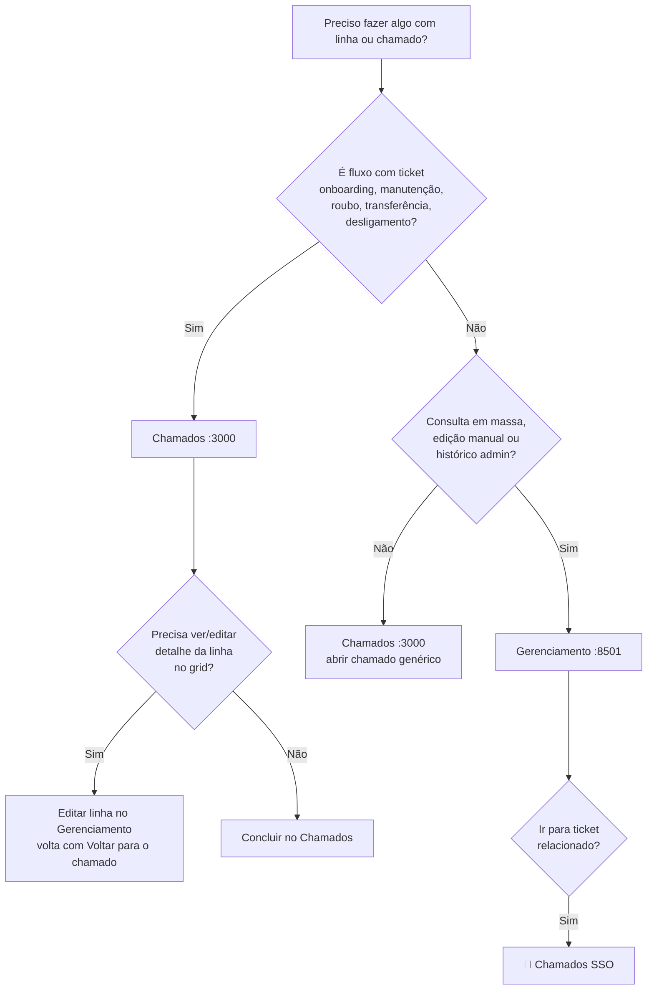

# Documentação — Monorepo Gerenciamento + Chamados

Índice central da documentação operacional e de arquitetura.

## Estrutura do repositório

```
GerenciamentoDeTelefones/          ← monorepo (este repo)
├── app.py, src/                   ← Gerenciamento de Telefones (Streamlit, :8501)
├── Sistema de Chamados TI/        ← Chamados TI (React :3000 + FastAPI :8000)
├── doc/                           ← documentação central (esta pasta)
├── scripts/                       ← init Postgres, migrações, utilitários
├── _archive/                      ← cópias históricas (não operacional)
├── .env.example                   ← variáveis do Gerenciamento (+ referência ao backend)
└── ativador_completo.bat          ← sobe os 3 serviços
```

## Início rápido

| Ação | Comando / arquivo |
|------|-------------------|
| Subir tudo (dev) | `ativador_completo.bat` |
| Só Gerenciamento | `ativador.bat` |
| Configurar banco | Copiar `.env.example` → `.env` e `backend/env.example` → `backend/.env` com **mesmo** `DATABASE_URL` |
| Criar schema Postgres | `python -m scripts.init_postgres` |

**URLs locais (ativador completo):**

- Gerenciamento: http://localhost:8501
- Chamados (web): http://localhost:3000
- Chamados (API): http://localhost:8000

---

## Documentos na raiz (`doc/`)

| Documento | Conteúdo |
|-----------|----------|
| [ARQUITETURA_SISTEMA_UNIFICADO.md](./ARQUITETURA_SISTEMA_UNIFICADO.md) | Visão alvo: um banco, um backend, auditoria única |
| [MAPA_MELHORIAS_INTEGRACAO.md](./MAPA_MELHORIAS_INTEGRACAO.md) | Roadmap por fases (auditoria, chamados, identidade) |
| [PLANO_FASES_BC_INTEGRACAO.md](./PLANO_FASES_BC_INTEGRACAO.md) | Plano detalhado Fases B e C (pós-organização Fase A) |
| [PLANO_PORTFOLIO_SISTEMA_COMPLETO.md](./PLANO_PORTFOLIO_SISTEMA_COMPLETO.md) | **Plano mestre** — Chamados principal, integração telefonia, portfólio |
| [SETUP_BANCO_LOCAL.md](./SETUP_BANCO_LOCAL.md) | PostgreSQL no PC (projeto pessoal), dump, Docker, verificação |
| [POPULAR_BANCO.md](./POPULAR_BANCO.md) | Importar linhas (planilhas, SQLite, dump) |
| [CHECKLIST_QA_INTEGRACAO.md](./CHECKLIST_QA_INTEGRACAO.md) | Checklist QA por fluxo operacional (Fase B4) |
| [POLITICA_SENHAS.md](./POLITICA_SENHAS.md) | Senha única, sync `usuarios_app` ↔ `users` (Fase B5) |

---

## Documentos do Sistema de Chamados (`Sistema de Chamados TI/doc/`)

| Documento | Conteúdo |
|-----------|----------|
| [BANCO_UNIFICADO.md](../Sistema%20de%20Chamados%20TI/doc/BANCO_UNIFICADO.md) | Login único, `usuarios_app`, SSO |
| [PLANO_INTEGRACAO_TELEFONES.md](../Sistema%20de%20Chamados%20TI/doc/PLANO_INTEGRACAO_TELEFONES.md) | Integração linhas ↔ chamados (histórico SQLite → Postgres) |
| [GUIA_INSTALACAO.md](../Sistema%20de%20Chamados%20TI/doc/GUIA_INSTALACAO.md) | Instalação backend + frontend |
| [POSTGRES.md](../Sistema%20de%20Chamados%20TI/doc/POSTGRES.md) | PostgreSQL no chamados |
| [STATUS_PROJETO.md](../Sistema%20de%20Chamados%20TI/doc/STATUS_PROJETO.md) | Status e pendências |
| [MAPAMENTAL_SISTEMA_CHAMADOS_TI.md](../Sistema%20de%20Chamados%20TI/doc/MAPAMENTAL_SISTEMA_CHAMADOS_TI.md) | Mapa mental do sistema de chamados |

---

## Papéis dos dois apps — matriz operacional (B4)

| Situação | App correto | Onde no menu / URL |
|----------|-------------|-------------------|
| Abrir chamado de TI (incidente, solicitação) | **Chamados** | Abrir chamado |
| Onboarding — atribuir linha a colaborador | **Chamados** | Telefonia → Onboarding (`?ticket_id=` se vier de ticket) |
| Manutenção / troca de aparelho | **Chamados** | Telefonia → Manutenção |
| Roubo ou perda de linha | **Chamados** | Telefonia → Roubo/Perda |
| Transferir linha de equipe/setor | **Chamados** | Telefonia → Transferência |
| Desligamento (liberar linha) | **Chamados** | Telefonia → Desligamento |
| Consultar muitas linhas, filtros, exportar visão | **Gerenciamento** | Painel principal (:8501) |
| Edição manual avulsa (sem fluxo de ticket) | **Gerenciamento** | Editar linha no grid |
| Histórico de auditoria, config admin, usuários | **Gerenciamento** | Configuração / Admin |
| Ver ticket aberto enquanto edita linha | **Gerenciamento** ← link do Chamados | Banner “Contexto de chamado” + **Voltar para o chamado** |
| Voltar ao ticket a partir do Gerenciamento | **Chamados** | Botão no banner ou **📌 Chamados** (SSO) |

| App | Escrita em `linhas` | Auditoria |
|-----|---------------------|-----------|
| **Chamados (React)** | API `/api/telefones/*` | `auditoria.chamado_id` = id do ticket |
| **Gerenciamento (Streamlit)** | `src/db/repository.py` | Com contexto de chamado na URL, grava `chamado_id` |

Ambos compartilham PostgreSQL, login (`usuarios_app`) e auditoria unificada.

### Fluxo de decisão



### QA e smoke

| Recurso | Caminho |
|---------|---------|
| Checklist QA por fluxo | [CHECKLIST_QA_INTEGRACAO.md](./CHECKLIST_QA_INTEGRACAO.md) |
| Smoke serviços + banco | `python -m scripts.smoke_integracao` |
| E2E auditoria API (B3) | `python -m scripts.test_auditoria_b3_e2e <senha>` |
| E2E navegação (B2) | `python -m scripts.test_navegacao_b2_e2e <senha>` |
| Sync usuários (B5) | `python -m scripts.sync_usuarios_chamados` |
| Linhas via API (C1) | `USE_TELEFONES_API=true` + `python -m scripts.test_c1_linhas_api <senha>` |

---

## Schema e scripts

| Recurso | Caminho |
|---------|---------|
| Schema Postgres unificado | `src/db/schema_postgres.sql` |
| Schema SQLite legado | `src/db/schema.sql` |
| Init Postgres | `python -m scripts.init_postgres` |
| Migração SQLite → Postgres | `python -m scripts.migrate_sqlite_to_postgres` |

---

## Arquivo histórico

Cópias antigas ficam em [`_archive/`](../_archive/README.md). Não usar para desenvolvimento.

---

*Última revisão: Fase B5 — sync usuários e política de senhas — maio/2026*
